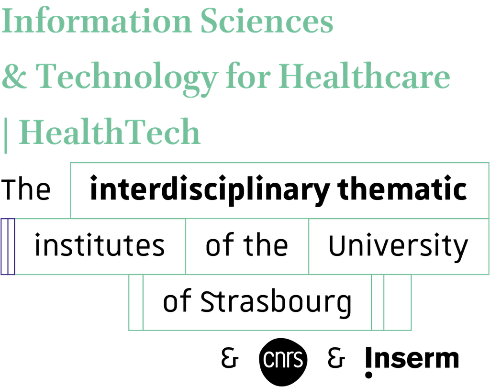

# RAMBO: Raman Spectroscopy Analysis Tool
<div display:"flex">
  
    
    
</div>

##

**A Dash-based application for interactive analysis and visualization of Raman spectra in biomedical research.**

## 📌 Overview
RAMBO is designed to streamline the analysis of Raman spectroscopy data for five biological tissues (bone, cartilage, skeletal muscle, tendon and adipose tissue). It provides an interactive web interface for preprocessing, peak detection, normalization, and visualization, with optional deep learning integration for automated tissue classification.

## ✨ Features
- **Interactive Dashboard**: Upload, process, and visualize Raman spectra in real-time.
- **Preprocessing Tools**: Smoothing, baseline correction, and normalization.
- **Peak Detection**: Automated identification of Raman peaks for biological tissues.
- **Deep Learning Integration**: TensorFlow/Keras model for spectral classification.
- **Export Options**: Save processed data and visualizations for further analysis.

## 🛠 Installation
### Prerequisites
- Python 3.8+
- Required libraries: `dash`, `pandas`, `numpy`, `scipy`, `tensorflow`, `plotly`, `dash-bootstrap-components`

### Steps
```bash
git clone https://github.com/yourusername/RAMBO.git
cd RAMBO
pip install -r requirements.txt
python dash_app.py
```
